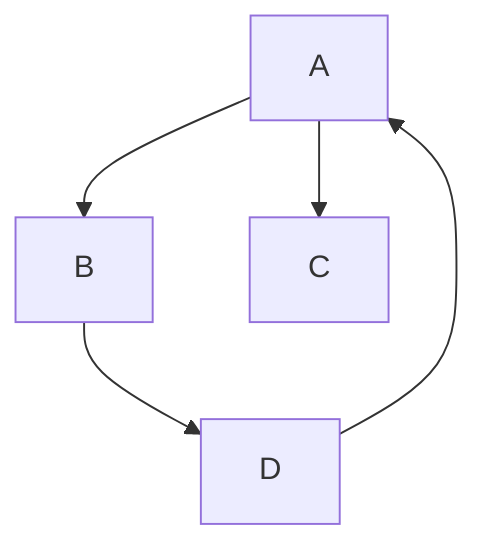
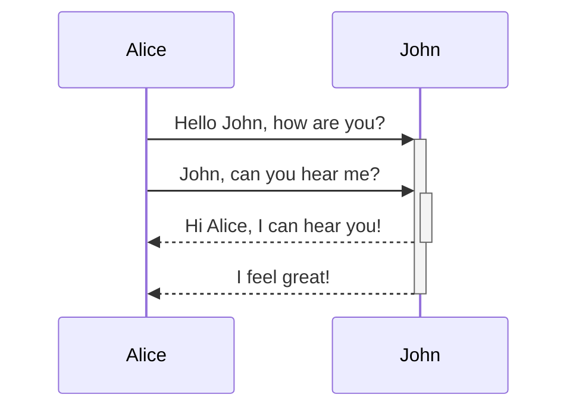

<!--

author:   André Dietrich
email:    LiaScript@web.de
version:  0.1.3
language: en
narrator: US English Female

script:   https://cdn.jsdelivr.net/npm/mermaid@9.4.3/dist/mermaid.min.js


@mermaid: @mermaid_(@uid,```@0```)

@mermaid_
<script run-once="true" modify="false" style="display:block; background: white">
mermaid.initialize({});

window.console.warn(`@1`.replace(/\\n/g, `
`))

var svg = mermaid.render('io9wuwzxt_@0',`@1`.replace(/\n/g, "\n"),
function(g) {
    return true;
})

"HTML:" + svg
</script>
@end

@mermaid_eval: @mermaid_eval_(@uid)

@mermaid_eval_
<script>
mermaid.initialize({});
var graphDefinition = `@input`
var cb = function(svgGraph) {
    return true;
}

var svg = mermaid.render('io9wuwzxt@0',graphDefinition,cb)
console.html(svg)
"LIA: stop"
</script>
@end

-->

# mermaid_template

                               --{{0}}--
This is a simple template for including [mermaidJS](https://github.com/knsv/mermaid)
graphs into LiaScript.

* See the mermaid docs [here...](https://mermaidjs.github.io/)
* See the Github version of this document [here...](https://github.com/liaScript/mermaid_template)
* See the LiaScript version of this document [here...](https://liascript.github.io/?https://raw.githubusercontent.com/liaScript/mermaid_template/master/README.md)

To use these macros within your document, simply import it into LiaScript via:

Which will be updated and might come with breaking changes:

`import: https://raw.githubusercontent.com/liaScript/mermaid_template/master/README.md`

or use this specific version and you course will be stable:

`import: https://raw.githubusercontent.com/LiaTemplates/mermaid_template/0.1.3/README.md`


__Overview:__

1. Use plain LiaScript-HTML
2. Use the inline Macro to generate graphs `@mermaid`
3. Use the Block-Macro notation `@mermaid`
4. Dynamically generate graphs `@mermaid_eval`

## Plain - HTML

                              --{{0}}--
If you are on github, you should see some odd looking code here, in contrast to
LiaScript which tries to execute also JavaScript code.

<script style="display: block; background: white" run-once="true" modify="false">
mermaid.initialize({});

var svg = mermaid.render(
'io9wuwzxt',
`journey
    title My working day
    section Go to work
      Make tea: 5: Me
      Go upstairs: 3: Me
      Do work: 1: Me, Cat
    section Go home
      Go downstairs: 5: Me
      Sit down: 5: Me`,
function(g) {
    return true;
})

"HTML: " + svg
</script>


## Inline

                              --{{0}}--
To simplify the usage of JavaScript libraries, LiaScript allows to define
macros, which allow to inject code during the parsing process. The following
macro, generates exactly the same graph as the previous example.

@mermaid(```flowchart LR
id1(This is the text in the box)```)


## Code-Block

                              --{{0}}--
For more complex examples you can also use the block-code notation, that results
in a nicely rendered code on github, but on LiaScript it is converted to a graph.



```text @mermaid
flowchart TB
    classDef someclass fill:#f96;
    A[Concrete] --> B
    A:::someclass --> C
    C[Language] --> V[Words]
    C --> W[Interaction]
    V --> I[Etymology]
    I --> AD[com lat. = together]
    AD:::someclass --> AK
    I --> AE(cretus lat. = grown)
    AE:::someclass --> AK[grown together]
    AK:::someclass
    
    V --> J[Collocations]
    J --> I
    J --> reinforced:::someclass 
    P --> R[Processes]
    R --> AK
    R --> AP[Inputs & Outputs]
    W --> P[Describing]
    J --> P
    W --> Q[Discussing]
    Q --> AG[Argumentation]
    AG --> AP
    AP --> S[Presentations]
    AP --> AQ[Texts]
    AQ <--> AR[Concept maps]
    S --> AI
    S <--> AR
    
    B[Subject] --> D[Composition]
    D --> N[Aggregate]:::someclass 
    D --> O[Cement]:::someclass 
    B --> E[Production]
    E --> L[Mixing]:::someclass 
    E --> M[Curing]:::someclass 
    B --> F[Structure]
    F --> AA[Homogeneity]:::someclass 
    F --> AB[Porosity]:::someclass 
    B --> G[Properties]
    G --> X[high compressive strength]:::someclass 
    G --> Y[Water resistant]:::someclass 
    B --> H[Applications]
    H --> Z[Dams]:::someclass 
    H --> AC[Furnaces]:::someclass 
    D --> E
    E --> F
    F --> G
    G --> H
    B --> AH
    H --> AH[Impacts]
    AH --> AJ[Economic]:::someclass    
    AH --> AI[Environmental]:::someclass 
    X --> Z
    Y --> Z
```


## Interactive

                              --{{0}}--
If you want to have an editable version of mermaid graphs, use the following
example. Simply double-click on the code to edit it and execute it by clicking
on the play-button.


@mermaid_eval
